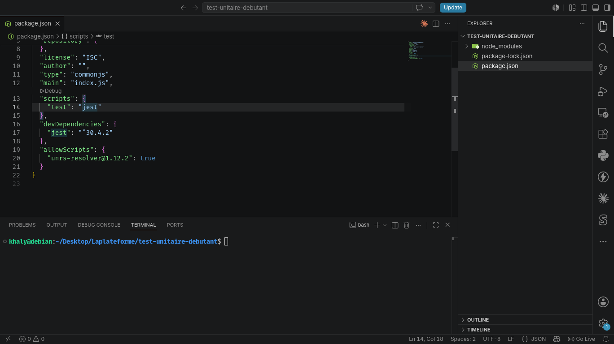
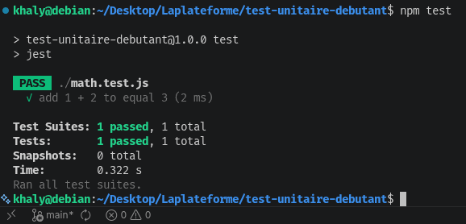
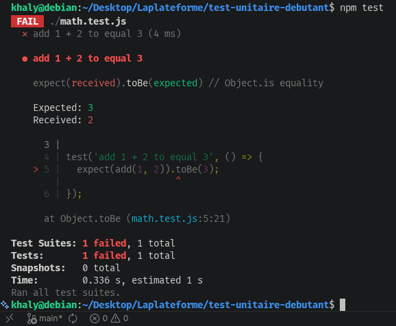
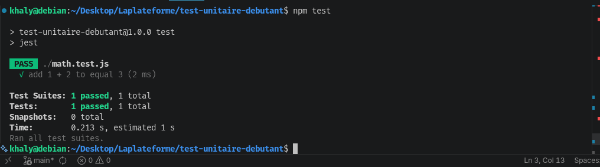

# TEST UNITAIRE

## PROJECT INIT:
 Initialisation du projet avec la commande `npm init` avec l'installation de jest `npm i --save-dev jest`. Et configuration du package.json ` "test": "jest"`
 

## First TEST:
Projet demarrer avec la commande `npm test` et passe avec succes

## TEST WITH ERROR:
Test avec erreur `return a * b` 

## ERROR SOLVED:
Test avec erreur `return a + b` 

